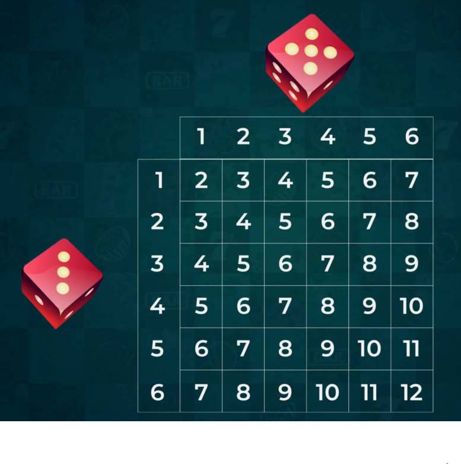
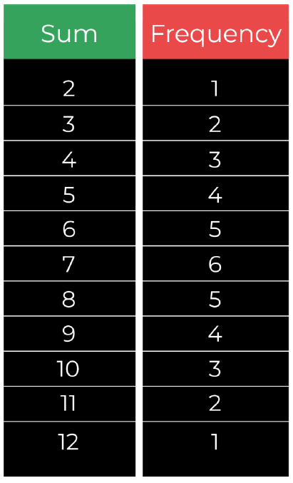
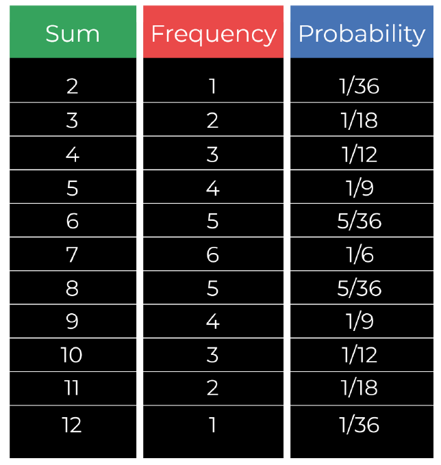
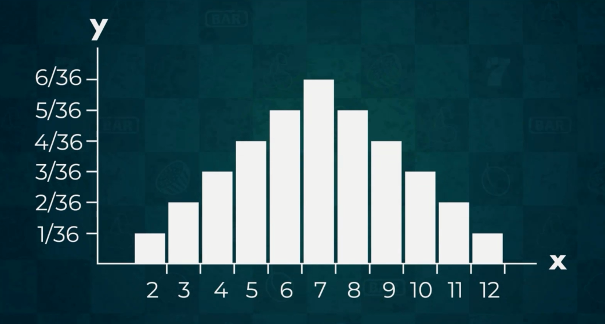

# [Start Data-science](https://rehammetwallybrakat.github.io/Study-Data-science/)

## Preview

**[View Live Preview](https://rehammetwallybrakat.github.io/Study-Data-science/)**

<!DOCTYPE html>
<html lang="en">

<head>

  <meta charset="utf-8">
  <meta name="viewport" content="width=device-width, initial-scale=1, shrink-to-fit=no">
  <meta name="description" content="">
  <meta name="author" content="">

  <title>Data Science Self_study</title>

  <!-- Bootstrap core CSS -->
  <link href="vendor/bootstrap/css/bootstrap.min.css" rel="stylesheet">

  <!-- Custom fonts for this template -->
  <link href="vendor/fontawesome-free/css/all.min.css" rel="stylesheet" type="text/css">
  <link href='https://fonts.googleapis.com/css?family=Lora:400,700,400italic,700italic' rel='stylesheet' type='text/css'>
  <link href='https://fonts.googleapis.com/css?family=Open+Sans:300italic,400italic,600italic,700italic,800italic,400,300,600,700,800' rel='stylesheet' type='text/css'>

  <!-- Custom styles for this template -->
  <link href="css/clean-blog.min.css" rel="stylesheet">

</head>

<body>

  <!-- Navigation -->
  <nav class="navbar navbar-expand-lg navbar-light fixed-top" id="mainNav">
    

      <a class="navbar-brand" href="index.html">Start Data Science</a>
      <button class="navbar-toggler navbar-toggler-right" type="button" data-toggle="collapse" data-target="#navbarResponsive" aria-controls="navbarResponsive" aria-expanded="false" aria-label="Toggle navigation">
        Menu
        <i class="fas fa-bars"></i>
      </button>
      

        <ul class="navbar-nav ml-auto">
          <li class="nav-item">
            <a class="nav-link" href="index.html">Probabilities</a>
          </li>
          <li class="nav-item">
            <a class="nav-link" href="about.html">Statistics</a>
          </li>
          <li class="nav-item">
            <a class="nav-link" href="post.html">Sample Post</a>
          </li>
          <li class="nav-item">
            <a class="nav-link" href="contact.html">Contact</a>
          </li>
        </ul>
      

    

  </nav>

  <!-- Page Header -->
  <header class="masthead" style="background-image: url('img/home-bg.jpg')">
    

    

      

        

          

            <h1>Probabilities</h1>
            
          

        

      

    

  </header>

  <!-- Main Content -->
  

    

      

        

          <a>
            <h2 class="post-title">
              Life is filled with uncertain events and often we must consider the possible outcomes before deciding 
            </h2>
            <h3 class="post-subtitle" style="color:#ff608d;font-family:'system-ui'">
              إن الحياة مليئة بالأحداث غير المؤكدة، ويتعين علينا في كثير من الأحيان نتأمل النتائج المحتملة قبل اتخاذ القرار
            </h3>
          </a>
        

        

        

          <a>
            <h2 class="post-title">
              We ask ourselves questions like what is the chance of success and what is the probability that we fail to
              determine whether the risk is worth taking
            </h2>
            <h3 class="post-subtitle" style="color:#ff608d;font-family:'system-ui'">
              ونحن نطرح على أنفسنا أسئلة مثل ما هي الفرصة المتاحة النجاح وما هو الاحتمال الذي نفشل فيه
                حدد ما إذا كانت المخاطرة تستحق المخاطرة
            </h3>
          </a>
        

        

        

          <a>
            <h2 class="post-title">
              Many CEOS need to make huge decisions when investing in their research and development
              departments or contemplating buyouts or mergers
            </h2>
            <h3 class="post-subtitle" style="color:#ff608d;font-family:'system-ui'">
              يحتاج العديد من CEOS
              إلى اتخاذ قرارات ضخمة عند الاستثمار في البحث والتطوير
أو التفكير في شراء الأسهم أو عمليات الدمج
            </h3>
          </a>

        

        

        

          <a>
            <h2 class="post-title">
              By using probability and statistical data they can predict how likely each outcome is
              and make the right call for their firm
            </h2>
            <h3 class="post-subtitle" style="color:#ff608d;font-family:'system-ui'">
              باستخدام الاحتمال والبيانات الإحصائية، يمكنهم توقع احتمالية كل نتيجة
و اتخاذ القرار الصحيح لشركتهم
            </h3>
          </a>
        

        

        

          <a>
            <h2 class="post-title">
              Probability: 
              is the chance of something happening

            </h2>
            <h3 class="post-subtitle" style="color:#ff608d;font-family:'system-ui'">
              هي فرصة حدوث شيء ما
            </h3>
          </a>
        

        

        

          <a>
            <h2 class="post-title">
              Academic definition: 
              is the likelihood of an event occurring

            </h2>
            <h3 class="post-subtitle" style="color:#ff608d;font-family:'system-ui'">
              هو احتمال وقوع حدث
            </h3>
          </a>
        

        

        

          <a>
            <h2 class="post-title">
              Event: 
              is the specific outcome or a combination of several outcomes

            </h2>
            <h3 class="post-subtitle" style="color:#ff608d;font-family:'system-ui'">
              هو  نتيجة محددة أو تشكيلة من النتائج المتعددة
            </h3>
          </a>
        

        

        

          <a>
            <h2 class="post-title">
              Examples: 
              Flipping a coin 
              Rolling a six sided die 
              Running a mile in under 6 minutes

            </h2>
            <h3 class="post-subtitle" style="color:#ff608d;font-family:'system-ui'">
              قلب عملة معدنية 
              دحرجة نرد من ستة جوانب 
الركض مسافة ميل في أقل من 6 دقائق
            </h3>
          </a>
        

        

        

          <a>
            <h2 class="post-title">
              We express probabilities numerically or as percentage or fractions

            </h2>
            <h3 class="post-subtitle" style="color:#ff608d;font-family:'system-ui'">
              نعبر عن الاحتمالات رقمياً أو كنسبة مئوية أو كسور
            </h3>
          </a>
        

        

        

          <a>
            <h2 class="post-title">
              We write them out using real numbers between 0 and 1

            </h2>
            <h3 class="post-subtitle" style="color:#ff608d;font-family:'system-ui'">
               قيمتها محصورة بين 0 و 1
            </h3>
          </a>
        

        

        

          <a>
            <h2 class="post-title">
              A probability of 1 expresses absolute certainty of the event occurring and
              0 expresses absolute certainty of the event not occurring

            </h2>
            <h3 class="post-subtitle" style="color:#ff608d;font-family:'system-ui'">
              يمثل احتمال 1 اليقين المطلق للحدث يحدث و
0 يعبر عن اليقين المطلق بعدم وقوع الحدث
            </h3>
          </a>
        

        

        

          <a>
            <h2 class="post-title">
              The probability of an event A occurring denoted 
              P(A)=the number of preferred outcomes/total number of
                possible outcomes

            </h2>
            <h3 class="post-subtitle" style="color:#ff608d;font-family:'system-ui'">
              P(A)=عدد النواتج المفضلة/إجمالي عدد
                النواتج المحتملة
            </h3>
          </a>
        

        

        

          <a>
            <h2 class="post-title">
              Sample Space: 
              is a term used to depict all possible outcomes going forward

            </h2>
            <h3 class="post-subtitle" style="color:#ff608d;font-family:'system-ui'">
              مصطلح يُستخدم لوصف كل النواتج المحتملة
            </h3>
          </a>
        

        

        

          <a>
            <h2 class="post-title">
              Example: 
                Flipping a coin and getting heads
            </h2>
            <h3 class="post-subtitle" style="color:#ff608d;font-family:'system-ui'">
              preferred outcome = 1  
              sample space = 2 
              P(H)=1/2=0.5
            </h3>
          </a>
        

        

        

          <a>
            <h2 class="post-title">
              Imagine we have a standard 6 sided die and we want to roll a 4 once again
            </h2>
            <h3 class="post-subtitle" style="color:#ff608d;font-family:'system-ui'">
              preferred outcome = 1  
              sample space = 6 
              P(H)=1/6=0.167
            </h3>
          </a>
        

        

        

          <a>
            <h2 class="post-title">
                What if we wanted to roll a number divisible by three
            </h2>
            <h3 class="post-subtitle" style="color:#ff608d;font-family:'system-ui'">
              preferred outcome = 2 [3 and 6]  
              sample space = 6 
              P(H)=2/6=0.33
            </h3>
          </a>
        

        

        

          <a>
            <h2 class="post-title">
              The probability of two independent events occurring at the same time
              is equal to the product of all the probabilities of the individual events
            </h2>
            <h3 class="post-subtitle" style="color:#ff608d;font-family:'system-ui'">
              احتمال وقوع حدثين مستقلين في نفس الوقت
يساوي ناتج ضرب جميع احتمالات الأحداث كلا على حده
            </h3>
          </a>
        

        

        

          <a>
            <h2 class="post-title">
              For instance: 
              The likelihood of getting the ace of spades equals the probability of getting an ace times
              the probability of getting a spade
            </h2>
            <h3 class="post-subtitle" style="color:#ff608d;font-family:'system-ui'">
              P(Ace.Spade) = P(Ace)*P(Spade)
            </h3>
          </a>
        

        

        

          <a>
            <h2 class="post-title">
              Expected values: 
              represent what we expect the outcome to be if we run an experiment many times
            </h2>
            <h3 class="post-subtitle" style="color:#ff608d;font-family:'system-ui'">
              هى النتيجه المتوقعة إذا قمنا بإجراء تجربة عدة مرات
            </h3>
          </a>
        

        

        

          <a>
            <h2 class="post-title">
              An experiment: 
               doing a trial by completing multiple trials
            </h2>
            <h3 class="post-subtitle" style="color:#ff608d;font-family:'system-ui'">
              إجراء تجربة من خلال إكمال عدة محاولات
            </h3>
          </a>
        

        

        

          <a>
            <h2 class="post-title">
              For example: 
              if we toss a coin 20 times and record the 20 outcomes that entire process
              is a single experiment with 20 trials.

            </h2>
            <h3 class="post-subtitle" style="color:#ff608d;font-family:'system-ui'">
              إذا قذف عملة معدنية 20 مرة وسجّل النتائج العشرين التي تتم معالجتها بالكامل
هي تجربة واحدة تحتوي على 20 محاولة.
            </h3>
          </a>
        

        

        

          <a>
            <h2 class="post-title">
              Experimental probabilities: 
              the probabilities we get after conducting experiments

            </h2>
            <h3 class="post-subtitle" style="color:#ff608d;font-family:'system-ui'">
              الاحتمالات التي نحصل عليها بعد إجراء التجارب
            </h3>
          </a>
        

        

        

          <a>
            <h2 class="post-title">
              The experimental probabilities we get are not always equal to the theoretical
              ones but are a good approximation

            </h2>
            <h3 class="post-subtitle" style="color:#ff608d;font-family:'system-ui'">
              إن الاحتمالات التجريبية التي نحصل عليها لا تساوى دوماً النظرية
ولكنها تقريب جيد
            </h3>
          </a>
        

        

        

          <a>
            <h2 class="post-title">
              The formula we use to calculate experimental probabilities is similar to the formula
              applied for the theoretical ones
              [It is simply the number of successful trials divided by the total number of trials]

            </h2>
            <h3 class="post-subtitle" style="color:#ff608d;font-family:'system-ui'">
               الصيغة التي نستخدمها لحساب الاحتمالات التجريبية متماثلة مع الصيغة التى
تطبق على الاحتمالات النظرية [عدد المحاولات الناجحه مقسموما على العدد الكلى للمحاولات]
            </h3>
          </a>
        

        

        

          <a>
            <h2 class="post-title">
              The expected value of an event E(A): 
              multiplying the theoretical probability of the event P(A) by the number of trials
            </h2>
            <h3 class="post-subtitle" style="color:#ff608d;font-family:'system-ui'">
               E(A)=P(A)*n
            </h3>
          </a>
        

        

        

          <a>
            <h2 class="post-title">
              For instance: 
              You are trying to hit a target with a bow and arrow the target has three layers 
              The outermost one is worth 10 points 
              The second one is worth 20 points 
              and the bullseye is worth 100
            </h2>
            <h3 class="post-subtitle" style="color:#ff608d;font-family:'system-ui'">
              The probability of hitting each layer is as follows 
              P(10) = 0.5 
              P(20) = 0.4 
              P(100) =  0.1 
              E(10,20,100) = 0.5 * 10 + 0.4 * 20 + 0.1 * 100 = 5 + 8 + 10 = 23 points

            </h3>
          </a>
        

        

        

          <a>
            <h2 class="post-title">
              Why is it important to know what the expected value of an event? 
              You are trying to hit a target with a bow and arrow the target has three layers 
              The outermost one is worth 10 points 
              The second one is worth 20 points 
              and the bullseye is worth 100
            </h2>
            <h3 class="post-subtitle" style="color:#ff608d;font-family:'system-ui'">
              is we can use expected values to make predictions about the future based on past data
            </h3>
          </a>
        

        

        

          <a>
            <h2 class="post-title">
              Meteorologists often use these when forecasting the weather 
              They do not know exactly how much snow rain or wind there is going to be
              So they provide us with likely intervals instead
            </h2>
            <h3 class="post-subtitle" style="color:#ff608d;font-family:'system-ui'">
              غالبًا ما يستخدم علماء الأرصاد الجوية هذه الحالات عند التنبؤ بالطقس
فهم لا يعرفون بالضبط كم الأمطار الثلجية أو الرياح هناك ستكون
              لذا فهي تزودنا ب interval   محتملة بدلاً من ذلك
            </h3>
          </a>
        

        

        

          <a>
            <h2 class="post-title">
              The expected value is used when trying to predict future events
            </h2>
            <h3 class="post-subtitle" style="color:#ff608d;font-family:'system-ui'">
              يتم استخدام القيمة المتوقعة عند محاولة التنبؤ بالمستقبل الأحداث
            </h3>
          </a>
        

        

        

          <a>
            <h2 class="post-title">
              Sometimes the result of the expected value is confusing or doesn't tell us much
            </h2>
            <h3 class="post-subtitle" style="color:#ff608d;font-family:'system-ui'">
              أحيانًا تكون نتيجة القيمة المتوقعة مربكة أو لا يخبرنا الكثير
            </h3>
          </a>
        

        

        

          <a>
            <h2 class="post-title">
              Frequency: 
              is the number of times a given value or outcome appears in the sample space

            </h2>
            <h3 class="post-subtitle" style="color:#ff608d;font-family:'system-ui'">
              هو عدد المرات التي تكون فيها القيمة أو الناتج معطى يظهر في فضاء العينة
            </h3>
          </a>
        

        

        

          <a>
            <h2 class="post-title">
              For instance: 
              Throwing two standard six sided dice and adding up the numbers

            </h2>
            <h3 class="post-subtitle" style="color:#ff608d;font-family:'system-ui'">
              That gives us a total of six times six equals 36 different outcomes for the two roles 
              we can write out the results in a 6 * 6 table where rewrite the sum of the two dice
            </h3>
            
            <h3 class="post-subtitle">
              Notice how 7 occurs 6 times in the table so the chance of getting a seven 
              This means: 
              favorable outcomes = 6 
              total possible outcomes = 36 
              P(7) = 6/36 = 1/6  
            </h3>
          </a>
        

        

        

          <a>
            <h2 class="post-title">
              A frequency distribution table: 
              is a table matching each distinct outcome in the sample space to its associated frequency

            </h2>
            <h3 class="post-subtitle" style="color:#ff608d;font-family:'system-ui'">
              هو جدول يحتوى على كل ناتج مع عدد مرات ظهوره فى فضاء العينه
            </h3>
            

          </a>
        

        

        

          <a>
            <h2 class="post-title">
              We simply divide the frequency for each possible outcome by the size of the sample space
            </h2>
            <h3 class="post-subtitle" style="color:#ff608d;font-family:'system-ui'">
              ببساطة نقسّم عدد ظهور كل نتيجة محتملة على حجم فضاء العينة
            </h3>
          </a>
        

        

        

          <a>
            <h2 class="post-title">
              A probability frequency distribution: 
              is a collection of the probabilities for each possible outcome

            </h2>
            <h3 class="post-subtitle" style="color:#ff608d;font-family:'system-ui'">
              هو مجموعة من الاحتمالات لكل ناتج محتمل
            </h3>
          </a>
        

        

        

          <a>
            <h2 class="post-title">
              We can express this probability frequency distribution through a table or a graph
            </h2>
            <h3 class="post-subtitle" style="color:#ff608d;font-family:'system-ui'">
              يمكننا التعبير عن توزيع تكرار الاحتمال هذا من خلال جدول أو رسم بياني
            </h3>
            

              
              
            

            <h2 class="post-title">
              On the graph we see the probability frequency distribution: 
              The x axis depicts the different possible numbers of spades we can get and 
              the y axis represents the probability of getting each outcome when making predictions
            </h2>
            <h3 class="post-subtitle" style="color:#ff608d;font-family:'system-ui'">
              في الرسم البياني، نرى توزيع تردد الاحتمال:
              يصف المحور  x  الأعداد المحتملة المختلفة من البستوني يمكننا الحصول على و
يمثل المحور  y  احتمال الحصول على كل ناتج عند وضع التوقعات
            </h3>

          </a>
        

        

        

          <a>
            <h2 class="post-title">
              We generally want our interval to have the highest probability
            </h2>
            <h3 class="post-subtitle" style="color:#ff608d;font-family:'system-ui'">
              ونريد بشكل عام أن يكون الفاصل الزمني الخاص بنا هو الاحتمال الأكبر
            </h3>
<!--            
-->
<!--              
<!--                   style="display: inline-block;margin-left: auto;margin-right: auto;"/>-->
<!--              
<!--                   style="display: inline-block;margin-left: auto;margin-right: auto;"/>-->
<!--            
-->
          </a>
        

        

        

          <a>
            <h2 class="post-title">
              We can see that the individual outcomes with the highest probability
              are the ones with the highest bars in the graph usually the highest bars
              will form around the expected value

            </h2>
            <h3 class="post-subtitle" style="color:#ff608d;font-family:'system-ui'">
              وبوسعنا أن نرى النتائج الفردية الأعلى الاحتمال
هُوَ الْآحَادُ بِأَعْلِيِّ الْأَعْمِدَةِ فِي التَّمْثِيلِ الْ وعادة ما تكون أعلى  bar 
سوف تتكون حول القيمة المتوقعة
            </h3>
          </a>
        

<!--        
-->
<!--        
-->
<!--          <a>-->
<!--            <h2 class="post-title">-->
<!--              A probability frequency distribution: -->
<!--              is a collection of the probabilities for each possible outcome-->

<!--            </h2>-->
<!--            <h3 class="post-subtitle" style="color:#ff608d;font-family:'system-ui'">-->
<!--              هو مجموعة من الاحتمالات لكل ناتج محتمل-->
<!--            </h3>-->
<!--            -->
<!--          </a>-->
<!--        
-->
<!--        
-->
<!--        
-->
<!--          <a>-->
<!--            <h2 class="post-title">-->
<!--              A probability frequency distribution: -->
<!--              is a collection of the probabilities for each possible outcome-->

<!--            </h2>-->
<!--            <h3 class="post-subtitle" style="color:#ff608d;font-family:'system-ui'">-->
<!--              هو مجموعة من الاحتمالات لكل ناتج محتمل-->
<!--            </h3>-->
<!--            -->
<!--          </a>-->
<!--        
-->
<!--        
-->
<!--        
-->
<!--          <a>-->
<!--            <h2 class="post-title">-->
<!--              We can see that the individual outcomes with the highest probability are the ones with the highest bars-->
<!--              in the graph usually the highest bars will form around the expected value-->

<!--            </h2>-->
<!--            <h3 class="post-subtitle" style="color:#ff608d;font-family:'system-ui'">-->
<!--              وبوسعنا أن نرى النتائج الفردية الأعلى الاحتمالية هي تلك التي لها أعلى أشرطة-->
<!--في الرسم البياني عادةً، ستتكوّن أعلى أشرطة حول القيمة المتوقعة-->
<!--            </h3>-->
<!--          </a>-->
<!--        
-->
        

        

          <a>
            <h2 class="post-title">
              This suggests that if we want the interval with the highest probability we should construct it around
              the expected value

            </h2>
            <h3 class="post-subtitle" style="color:#ff608d;font-family:'system-ui'">
              وهذا يشير إلى أننا إذا أردنا أن يكون  interval  مع الاحتمال الأكبر  ينبغي لنا أن نبنيه من حول
القيمة المتوقعة
            </h3>
          </a>
        

      

    

  

  

  <!-- Footer -->
  <footer>
    

      

        

          <ul class="list-inline text-center">
            <li class="list-inline-item">
              <a href="https://www.linkedin.com/in/reham-metwally-data-scientist">
                
                  <i class="fas fa-circle fa-stack-2x"></i>
                  <i class="fab fa-linkedin-in fa-stack-1x fa-inverse"></i>
                
              </a>
            </li>
            <li class="list-inline-item">
              <a href="https://www.facebook.com/profile.php?id=100006310247542">
                
                  <i class="fas fa-circle fa-stack-2x"></i>
                  <i class="fab fa-facebook-f fa-stack-1x fa-inverse"></i>
                
              </a>
            </li>
            <li class="list-inline-item">
              <a href="https://github.com/RehamMetwallyBrakat">
                
                  <i class="fas fa-circle fa-stack-2x"></i>
                  <i class="fab fa-github fa-stack-1x fa-inverse"></i>
                
              </a>
            </li>
          </ul>
          
Copyright &copy; Reham Metwally 2020

        

      

    

  </footer>

  <!-- Bootstrap core JavaScript -->
  
  

  <!-- Custom scripts for this template -->
  

</body>

</html>
>>>>>>> 768b5ab5079de24682082dad0b1a13d41d99c433
